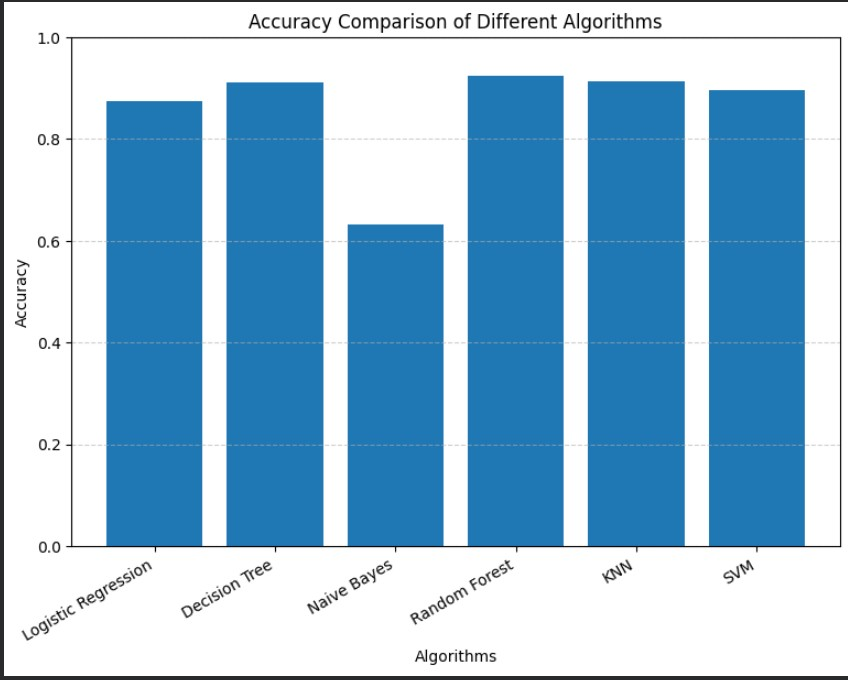
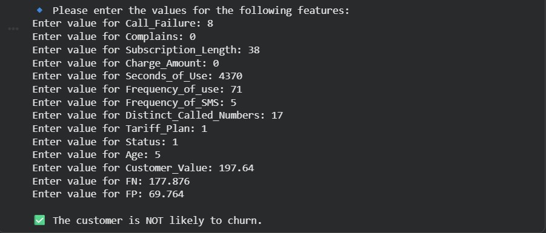

# 📊 Customer Churn Prediction

Customer churn prediction is an important task for businesses because losing customers directly impacts revenue. This project uses **supervised machine learning algorithms** to analyze customer behavior and predict whether a customer is likely to churn or not.

The system analyzes historical customer data such as service usage, complaints, subscription length, and billing information to identify patterns that indicate potential churn.

---

## 🚀 Project Overview

The objective of this project is to build a machine learning model that predicts customer churn so that businesses can take proactive measures to retain customers.

The dataset used in this project contains **3150 customer records** with multiple attributes related to customer activity and service usage.

---

## 🧠 Machine Learning Algorithms Used

The following algorithms were implemented and compared:

- Logistic Regression  
- Decision Tree  
- Naive Bayes  
- Random Forest  
- K-Nearest Neighbors (KNN)  
- Support Vector Machine (SVM)

---

## 📂 Dataset Features

The dataset contains features related to customer usage and service activity including:

- Call Failure  
- Complaints  
- Subscription Length  
- Charge Amount  
- Seconds of Use  
- Frequency of Use  
- Frequency of SMS  
- Distinct Called Numbers  
- Tariff Plan  
- Status  
- Age  
- Customer Value  

**Target Variable**

- Churn  
  - 1 → Customer churned  
  - 0 → Customer retained  

---

## ⚙️ Technologies Used

- Python  
- Pandas  
- NumPy  
- Matplotlib  
- Seaborn  
- Scikit-learn  

---

## 📊 Model Accuracy Comparison

| Algorithm | Accuracy |
|----------|----------|
| Logistic Regression | 85% |
| Decision Tree | 90% |
| Naive Bayes | 64% |
| Random Forest | 94% |
| KNN | 90% |
| SVM | 90% |

Random Forest achieved the **highest accuracy of 94%**.

---

## 📈 Accuracy Comparison Graph

The following graph compares the performance of different machine learning algorithms used in the customer churn prediction model.  
Among all the algorithms tested, **Random Forest achieved the highest accuracy of 94%**, making it the most effective model for predicting customer churn.

  

---

## 🖥️ Prediction Example

The image below shows an example output from the trained machine learning model.  
Based on the input customer data, the model predicts whether the customer is likely to churn or remain with the service.

  

---

## 🔮 Future Improvements

- Deploy the model as a **web application**
- Enable **real-time churn prediction**
- Integrate with **CRM systems**
- Improve accuracy using **advanced ML or deep learning models**

---

## 👨‍💻 Author

**Siddhartha Yalamanchili**  
📧 sidduyalamanchili3@gmail.com

---
